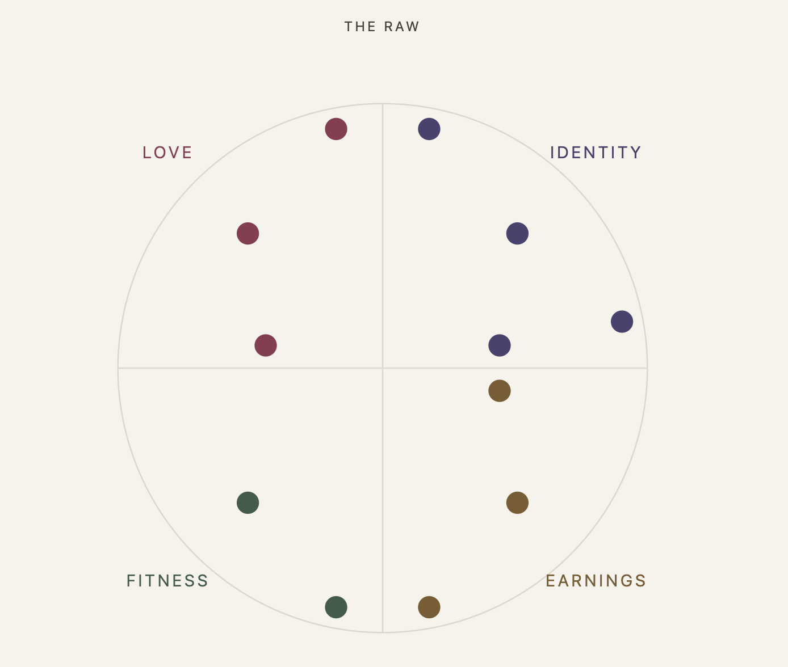
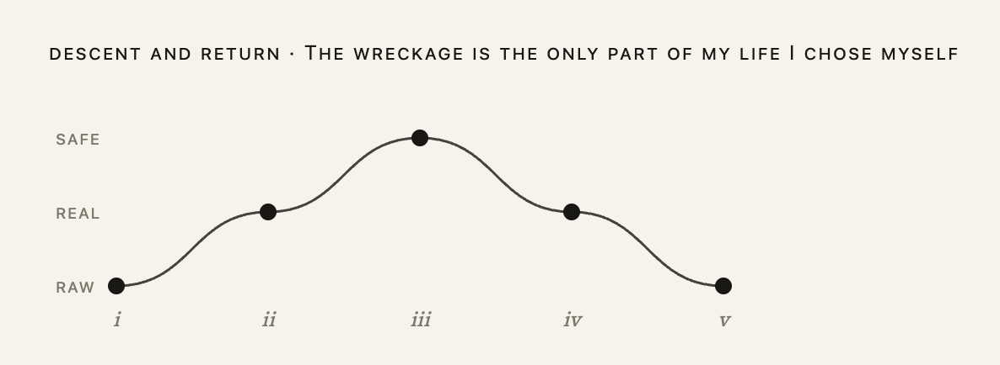

# BubbleMap

A local tool that takes a song's lyrics and works out what it's actually about, in
three tiers of honesty: from the reading anyone could give you, down to the one the
narrator would not admit.

It runs on your machine, keeps nothing in the cloud, and has mapped fourteen songs.

---

## The problem

You can tell when a song hits you. Naming what it's *about* is much harder, and if
you try it yourself you stall one layer down ("it's about heartbreak") and stop.

That stall is not an information problem. **The honest reading is the one you're
motivated not to reach**, because reaching it means noticing the same thing about
yourself.

So the tool's job is not to summarise a song. It is to get past the layer where you
stop.

| tier | what it is | the test |
|---|---|---|
| **SAFE** | The message the song can say out loud. True of many songs. Nobody is exposed. | Could be a caption. |
| **REAL** | The specific situation underneath. Names a want, a fear, a failure. | Could be said to a friend. |
| **RAW** | What the narrator would not admit to himself. Unflattering, specific, costly. | Could only be said at 3am. |

A second axis crosses it: **Love, Identity, Fitness, Earnings**. It exists because
the interesting finding is when a song *changes subject* as it deepens. A breakup
song whose surface is Love and whose raw layer is Identity was never really about
her.

---

## What it produces

Paste a song. In about forty seconds the first complete reading lands. Twelve arrive
over the next few minutes, one at a time, so you read while it works.

Each is a descent (SAFE, then REAL, then RAW) with the lyric that produced each step,
and a note on the RAW that does the actual work. From *Money*:

> **I keep my wants cartoonish so no one grades me on missing**
>
> A football team. A Lear jet. Caviar. Listen to what I ask for out loud: nothing a
> man could actually be held to. If I said I wanted a house on the good side of
> town, or to be the one they promote, someone could check next year whether I got
> there. So I pick wants that are obviously a joke, and then I get to be the funny
> greedy bastard at the bar instead of the bloke who tried for something ordinary
> and came up short.

There are four views over the same map, each answering a question the others can't.
The **readings** show one descent at a time. The **grid** shows which lyric spawned
what. The **target** shows which quadrant the raw layer landed in. The **arc**
rewrites the song as RAW → REAL → SAFE → REAL → RAW, on the theory that nobody can
hold raw for eight minutes: you surface for air, then dive again.



---

## Running it

```bash
npm install
cp .env.example .env      # add ANTHROPIC_API_KEY
npm run dev               # Express on :8787, Vite on :5173
```

Local only. No accounts, no cloud, no telemetry. Maps are JSON files on disk.

---

## How it was built

Two models with different jobs and an explicit boundary between them. An
**architect** (Opus) specifies, rules on the data model and the prompts, and does not
touch code. An **implementer** (Fable) builds, and is authorised to decide everything
except four things: the data model, the system prompt, a hard rule, or a stated
non-goal.

That boundary was not the original design. It became [D36](DECISIONS.md) after
measuring that the architect was the slowest step in the system, and that **the
implementer had independently caught four specification errors and been right every
time.** The gate was costing more than it was catching, so it was narrowed.

**Every decision is written down with its argument attached.** There are
[58 of them](DECISIONS.md), [six of which died](DECISIONS-superseded.md), each with a
note on why it doesn't come back. That's deliberate. A ruling with its reasoning
visible can be overturned by anyone who finds the reasoning false. A bare ruling can
only be overturned by whoever made it, which means it usually isn't.

---

## The product decisions worth reading

**The riskiest assumption was tested before any interface existed.** The first build
was a command-line probe, with no UI, no canvas and no persistence, that answered one
question: can the prompt reach RAW at all, or does it produce REAL with stronger
adjectives? Everything downstream was gated on that. ([Phase 0](ARCHITECTURE.md))

**The canvas was designed, built, and deleted.** The original layout was a radial
target with RAW at the centre. It rendered badly, and the reason was structural
rather than aesthetic: **radial layouts are chosen because they give more area at
depth, and this one gave less.** RAW held the most text and had the least room. It
was replaced by a grid, and the React Flow dependency was removed entirely.
([D20](DECISIONS.md), [D21](DECISIONS.md))

**The first interface looked like generic AI output**: dark mode, indigo, rounded
cards with glow. Those are documented tells rather than a matter of taste, and the
fix was to stop using containers to express depth and use typography instead. SAFE is
small grey sans; RAW is large serif in near-black. That single change removed the
cards, the colour bars and the glow at once. ([D22](DECISIONS.md))

**A feature was cut after five songs of never being used.** A "keeper" gesture let
you mark the strongest reading. Five consecutive songs produced zero keepers, but an
arc was built the day arcs shipped, unprompted. The finding: **judgment happens when
it produces something, not when it labels something.** The keeper was removed and the
arc became the act of choosing. ([D48](DECISIONS.md))



---

## Failure cases found in use

These were found by using the tool, not by reading the code. None of them appeared in
any written status report.

**The citation guard was silently deleting the best output.** Every bubble must cite
the lyric it derives from, and the server rejected any whose citation didn't match
the source. On one song it deleted six readings, including the strongest ones,
because the model had cited a real couplet joined across a line break and the matcher
required the two lines to be contiguous. **The guard was checking form rather than
truth.** It now flags instead of rejecting: the reading survives, marked *citation
unverified*, and the human decides. The rate went from six deletions to one flag
across the twenty-three readings of the next song. ([D39](DECISIONS.md),
[D52](DECISIONS.md))

**The interface reported three false states at once.** A run said "no deeper reading
found" on descents whose output had been discarded, and "the song ran out of threads"
when the guard had removed them. Three surfaces, three wrong messages, one cause.
Terminal states now distinguish *declined* from *discarded*, and the system does not
report its own failure as the song's. ([D40](DECISIONS.md))

**A whole map was lost to autosave.** The save used an 800ms trailing debounce that
reset on every action, so judging a full run in quick succession never wrote anything
at all, and a reload lost everything. The timer was being starved rather than raced.
Saves are now immediate and coalesced.

**A shipped change never ran for nine songs.** The descent ceiling was raised from ten
to twelve and reported live in good faith, but had no effect: HMR replaced the module
without recreating the store that had captured the old constant. Nine consecutive
songs landed on exactly ten and nobody read the pattern. The code was correct, the
report was honest, and the behaviour was unchanged.

**One layout bug turned out not to exist.** A clipped view was reported twice from
screenshots taken at 125% browser zoom. Both readings dissolved under
`getBoundingClientRect`. The standing rule now is that **the architect reports
impressions and the implementer reports measurements.** "This reads cramped" is a
valid finding; "this is 410px from the left" is not.

---

## How the output was evaluated

The core quality question, whether a reading is actually raw or merely well-written,
has no automated metric. It was tested three ways.

**The blind descent test.** Twelve SAFE→REAL pairs, with the REAL step hidden. The
rule being tested is that each step must add information that could be wrong, so the
question was whether the hidden step could have been predicted. Nine of twelve
surprised. Anything predictable is paraphrase, which is the failure the prompt exists
to prevent. It ran in a purpose-built stepper, because you cannot un-see an answer.

**The flinch test.** Binary, and the only gate that ever blocked a phase: does any RAW
reading make you uncomfortable to have written down? It is the same criterion the
prompt applies to songs, turned on the tool.

**Mechanical guards for what humans read past.** Every citation is checked against the
source text. Verb contracts, tier counts and link kinds are enforced in the tool
schema rather than the prompt, on the principle that a constraint the model *cannot*
violate beats one it is asked not to. Rejections surface in the interface rather than
the console, because a silent discard produces symptoms far from its cause.

**A cross-song reading that had to be corrected.** Across the first eight songs, six
of the raw readings were the narrator *authoring another person's experience*, casting
them rather than losing them. At eleven songs that generalised: every line was a
self-protective arrangement the narrator built and won't dismantle. **Both readings
are still marked as suggestive rather than evidence**, because most of the lines
sampled were defaults rather than choices. [The caveat sits next to the finding](PRODUCT.md).

The raw results behind these figures, including per-item blind-test verdicts, the
citation flag counts run by run, and a plain statement of what is not measured, are
in [EVALUATION.md](EVALUATION.md).

---

## Feedback, and what changed

Every one of these came from using the tool and finding it wanting.

| what was wrong | what changed |
|---|---|
| *"I only see six things and no RAW anywhere."* RAW sat behind nine clicks. | The unit of judgment became the **whole descent** rather than the bubble. Generation runs to RAW automatically; the human judges complete readings. ([D25](DECISIONS.md)) |
| *"It's expecting too much of me to keep clicking."* | Descents **land by default**, and killing is the only gesture. The hard rule was formally amended rather than quietly bent. ([D26](DECISIONS.md)) |
| *"I stare at a blank screen for fifty seconds."* | The pasted lyrics render while it works, with a live counter. The screen is never silent. |
| *"It looks too AI-y."* | The editorial rebuild: paper, serif, hairlines, no dark mode. ([D22](DECISIONS.md)) |
| *"Add a song is buried under eight songs."* | The landing page became a question, *What song?*, with the library at the fold. ([D49](DECISIONS.md)) |
| *"I read something good and it just ends there."* | Highlight any phrase, ask for a deeper reading, keep digging into the answer. ([D45](DECISIONS.md)) |
| *"Twelve descent paths on one disc is a hairball."* | The dense view was kept where density is fine, in the peripheral signature, and the main view cropped to the one question it answers. ([D56](DECISIONS.md)) |
| *"I want to know **why** it works, not just what it says."* | A per-descent line naming what the writer did: the technique rather than the effect. Explicitly experimental and explicitly killable. ([D58](DECISIONS.md)) |

---

## Repository

| | |
|---|---|
| [`PRODUCT.md`](PRODUCT.md) | The problem, the non-goals, the pre-mortem, and what the corpus shows so far |
| [`DECISIONS.md`](DECISIONS.md) | The 52 standing decisions, with their arguments |
| [`DECISIONS-superseded.md`](DECISIONS-superseded.md) | Six that died, and why they don't come back |
| [`EVALUATION.md`](EVALUATION.md) | Blind-test results, citation flag counts, what is not measured |
| [`ARCHITECTURE.md`](ARCHITECTURE.md) | Data model, verbs, the system prompt |
| [`TESTING.md`](TESTING.md) | The end-to-end dogfood script |
| [`field-guides/`](field-guides/) | Method notes, each with an honest hit rate |

---

## What it isn't

Not multiplayer, not hosted, not a general mind-mapping tool, and not trying to be
any of those. The [non-goals are written down](PRODUCT.md) because scope creep is the
default failure, and naming what you won't build is the cheapest defence against it.

The standing rule for anything proposed: if it doesn't shorten the path from "I like
this song" to "here is the raw thing," it's out.
